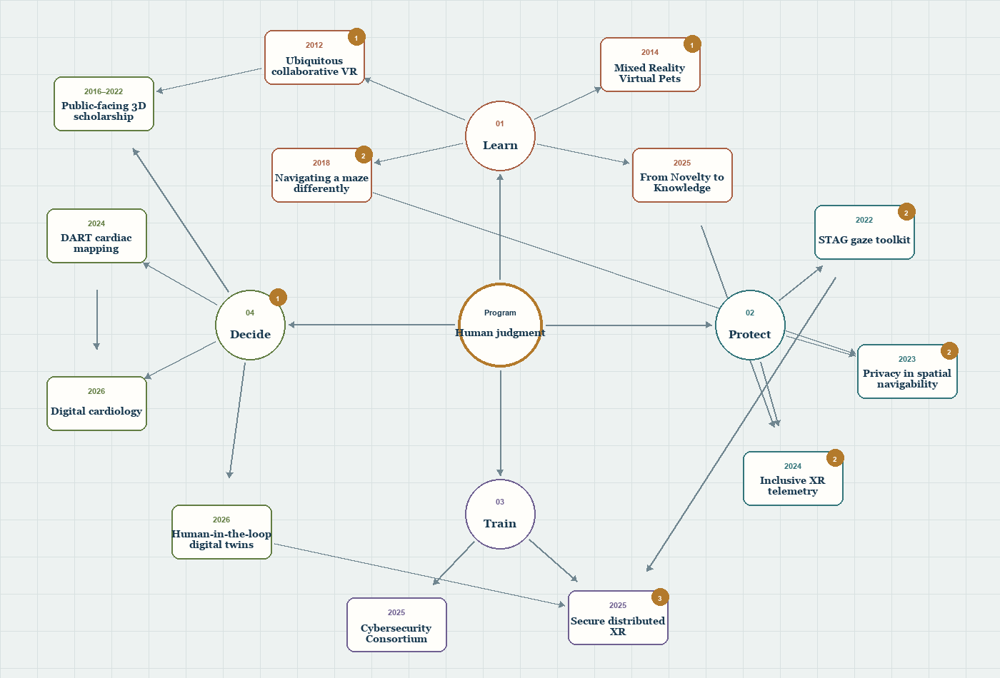

```{=html}
<div class="rae-page">
  <header class="rae-hero">
    <p class="rae-eyebrow">Research Evolution Atlas · 2012–2026</p>
    <div class="rae-hero__grid">
      <h1>How the ideas connect</h1>
      <p>Trace the provenance of a research program—from collaborative virtual reality to trustworthy spatial intelligence.</p>
    </div>
    <p class="rae-meta" aria-label="Atlas summary"><span>18 ideas</span><span>23 directional links</span><span>5 research threads</span></p>
  </header>

  <section class="rae-explorer" aria-labelledby="rae-map-title">
    <header class="rae-explorer__header">
      <div>
        <p class="rae-eyebrow">Interactive provenance map</p>
        <h2 id="rae-map-title">Follow a thread through the work</h2>
      </div>
      <div class="rae-view-controls" role="group" aria-label="Map view controls">
        <button id="rae-zoom-out" type="button" aria-label="Zoom out">−</button>
        <button id="rae-fit" type="button">Fit</button>
        <button id="rae-zoom-in" type="button" aria-label="Zoom in">+</button>
      </div>
    </header>

    <nav class="rae-threads" aria-label="Research evolution threads">
      <button type="button" data-rae-thread="all" aria-pressed="true">All ideas</button>
      <button type="button" data-rae-thread="foundations" aria-pressed="false">Foundations</button>
      <button type="button" data-rae-thread="learning" aria-pressed="false">Learning</button>
      <button type="button" data-rae-thread="measurement" aria-pressed="false">Measurement &amp; trust</button>
      <button type="button" data-rae-thread="translation" aria-pressed="false">Decision support</button>
      <button type="button" data-rae-thread="security" aria-pressed="false">Secure training</button>
    </nav>

    <p class="rae-thread-summary" id="rae-thread-summary">The complete program connects immersive learning, behavioral measurement, privacy, secure training, and expert decision support.</p>

    <div class="rae-workbench">
      <div class="rae-map-pane" id="rae-map-pane" tabindex="0" aria-label="Scrollable research provenance graph. Use the scrollbars, trackpad, or arrow keys to explore the map.">
        <div id="rae-map" class="rae-map" role="group" aria-labelledby="rae-map-title" aria-describedby="rae-map-description">
          <p id="rae-map-description" class="visually-hidden">A directional graph of research ideas. Select a node to reveal its description and complete contributing lineage.</p>
          
          <canvas id="rae-canvas" class="rae-canvas" width="2800" height="1900" aria-hidden="true"></canvas>
        </div>
        <div class="rae-map-legend" aria-hidden="true"><span><i></i>Influence</span><span>Scroll to explore · Select a node</span></div>
      </div>

      <section class="rae-detail" id="rae-detail" aria-label="Selected idea details" aria-live="polite" aria-atomic="true">
        <p class="rae-detail__index" id="rae-detail-index">Program · Core question</p>
        <h2 id="rae-detail-title">Human judgment</h2>
        <p class="rae-detail__description" id="rae-detail-description">How can immersive systems become measurable and adaptive while remaining trustworthy, inspectable, and centered on human agency?</p>

        <dl class="rae-detail__facts">
          <div><dt>Research lens</dt><dd id="rae-detail-lens">Across the research program</dd></div>
          <div><dt>Direct links</dt><dd id="rae-detail-links">4 connected ideas</dd></div>
        </dl>

        <section class="rae-sources" aria-labelledby="rae-sources-title">
          <header><h3 id="rae-sources-title">Evidence &amp; citations</h3><span id="rae-sources-count">Interpretive synthesis</span></header>
          <p class="rae-sources__empty" id="rae-sources-empty">This program-level synthesis is not assigned to a single paper.</p>
          <ol class="rae-sources__list" id="rae-sources-list"></ol>
          <p class="visually-hidden" id="rae-copy-status" role="status" aria-live="polite"></p>
        </section>

        <section class="rae-lineage" aria-labelledby="rae-lineage-title">
          <header><h3 id="rae-lineage-title">Contributing lineage</h3><span id="rae-lineage-count">Origin</span></header>
          <div id="rae-lineage-paths"></div>
        </section>
      </section>
    </div>

    <footer class="rae-explorer__footer">
      <p id="rae-status" role="status">Human judgment selected. Origin point in the research program.</p>
      <p aria-hidden="true">Select an idea to trace where it came from.</p>
    </footer>
  </section>

  <details class="rae-index">
    <summary>Browse the visible ideas as a text list</summary>
    <ul id="rae-index-list"></ul>
  </details>

  <noscript><p class="rae-noscript">This research map requires JavaScript for traversal. Its five paths cover immersive foundations, learning, measurement and trust, decision support, and secure training.</p></noscript>
</div>

<script src="atlas-data.js"></script>
<script src="atlas.js"></script>
```
