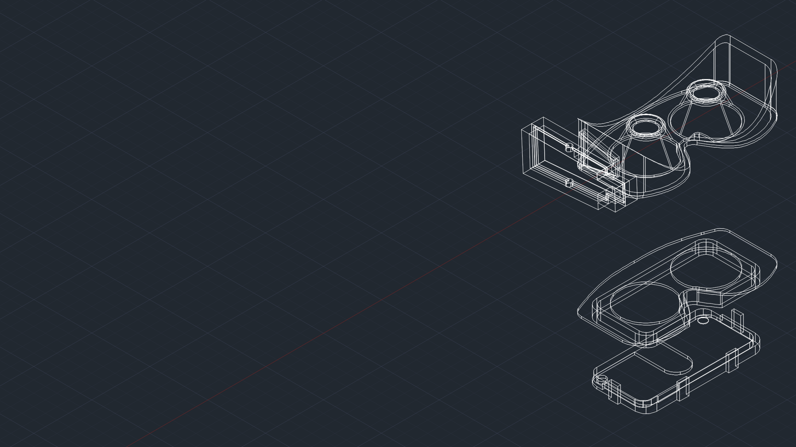
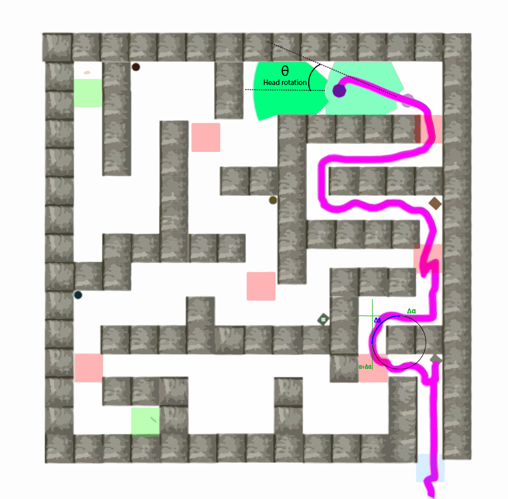

Dr. Aryabrata Basu is an Assistant Professor of Computer Science at the University of Arkansas at Little Rock and a research fellow in the Emerging Analytics Center. His research examines how virtual, augmented, and mixed reality systems can support human spatial decision-making, training, and collaboration, with careful attention to responsible AI and human-centered design.

At UA Little Rock, Dr. Basu leads Spatiotemporality, a research group exploring immersive systems as environments for learning, analysis, and public scholarship. His work brings together VR/AR/XR, human-computer interaction, spatial cognition, and AI policy to ask how emerging technologies can extend human capability while remaining inclusive and accountable.

Explore the site for recent news, publications, selected media, and links to academic materials, collaborators, and affiliated research centers.

## Research & Media Gallery

  
Research archive

  
Selected work, 2014–2025

A record of research visualizations, academic recognition, and public scholarship from the Spatiotemporality lab.

<section class="scholar-gallery" aria-label="Research and media gallery">
  <figure class="scholar-gallery__item scholar-gallery__item--feature">
    <button type="button" class="gallery-story" aria-haspopup="dialog"></button>
    <figcaption>Immersive systems<strong>Human-centered VR</strong>Technology in contextThe lab investigates immersive systems as social and cognitive environments, with human agency and context at the center of design.</figcaption>
  </figure>
  <figure class="scholar-gallery__item">
    <button type="button" class="gallery-story" aria-haspopup="dialog"></button>
    <figcaption>Faculty<strong>UA Little Rock</strong>Computer Science and Emerging AnalyticsAt UA Little Rock, Dr. Basu leads research at the intersection of immersive systems, human-centered computing, and responsible AI.</figcaption>
  </figure>
  <figure class="scholar-gallery__item">
    <button type="button" class="gallery-story" aria-haspopup="dialog"></button>
    <figcaption>Recognition<strong>IEEE VR 2025</strong>Best Paper Honorable MentionThis recognition from IEEE VR 2025 honors research advancing the design and understanding of immersive experiences.</figcaption>
  </figure>
  <figure class="scholar-gallery__item">
    <button type="button" class="gallery-story" aria-haspopup="dialog"></button>
    <figcaption>Recognition<strong>Best Paper Award</strong>Research excellence across disciplinesA milestone in a career centered on connecting rigorous technical inquiry with the needs of people who use emerging technologies.</figcaption>
  </figure>
  <figure class="scholar-gallery__item">
    <button type="button" class="gallery-story" aria-haspopup="dialog"></button>
    <figcaption>Field note<strong>Solar eclipse</strong>Wonder, observation, and scaleA field note on observation and scale: the same curiosity that guides a moment of wonder also drives careful study of complex systems.</figcaption>
  </figure>
  <figure class="scholar-gallery__item">
    <button type="button" class="gallery-story" aria-haspopup="dialog"></button>
    <figcaption>Public scholarship<strong>America250 feature</strong>Research beyond the laboratoryPublic-facing conversations translate research questions about technology, access, and human experience beyond the laboratory.</figcaption>
  </figure>
  <figure class="scholar-gallery__item">
    <button type="button" class="gallery-story" aria-haspopup="dialog"></button>
    <figcaption>Collaboration<strong>Emory partnership</strong>Cross-institutional researchCollaborative research creates the conditions for new questions, combining perspectives across institutions and disciplines.</figcaption>
  </figure>
  <figure class="scholar-gallery__item">
    <button type="button" class="gallery-story" aria-haspopup="dialog"></button>
    <figcaption>Research visualization<strong>Spatial decision-making</strong>Mapping how expertise shapes navigationThis trajectory visualization compares how expert and non-expert navigators interpret spatial cues while making decisions in immersive environments.</figcaption>
  </figure>
</section>

<dialog id="gallery-story-dialog" class="gallery-story-dialog" aria-labelledby="gallery-story-title">
  <button type="button" class="gallery-story-dialog__close" aria-label="Close expanded gallery story">Close</button>
  

    
    

      

      <h3 id="gallery-story-title"></h3>
      

      

    

  

</dialog>
