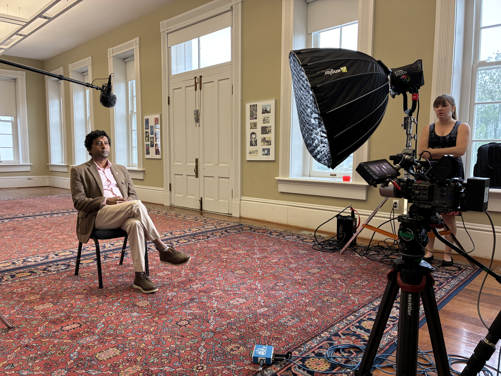
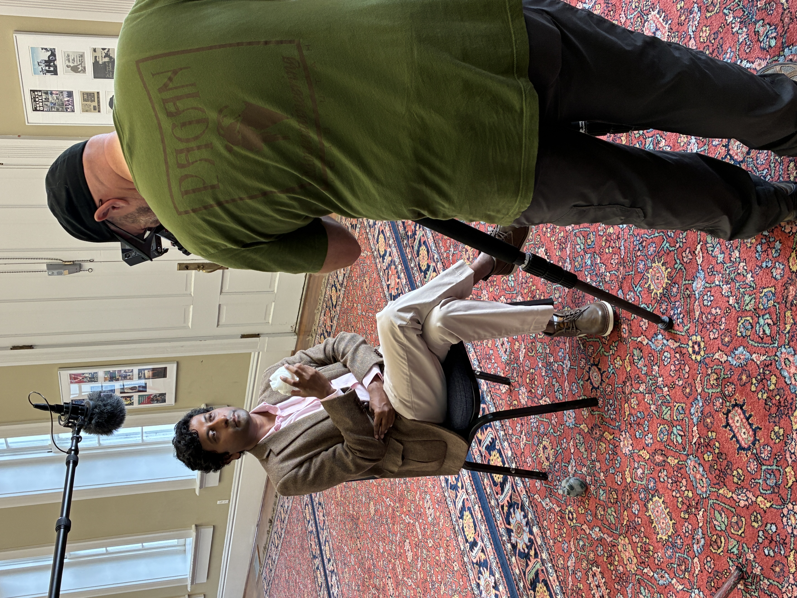
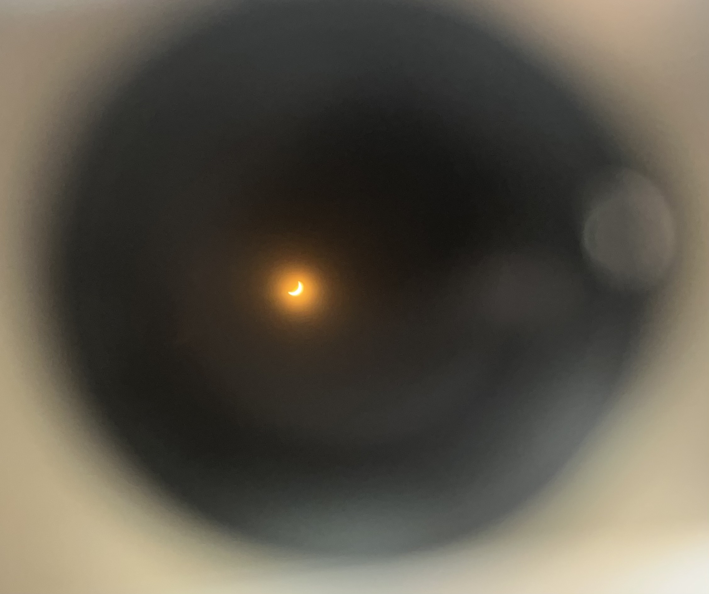

::: news-item
12/05/2025
Founding of Spatiotemporality Research Group

Dr. Aryabrata Basu founded his new research group called **'Spatiotemporality'** comprising his active graduate students at UA Little Rock.
:::

::: news-item
10/09/2025
America250's "Our American Story" - Featured Researcher

Dr. Aryabrata Basu, Assistant Professor of Computer Science at the University of Arkansas at Little Rock, was recently selected to be featured in *America250's "Our American Story"*, a national project commemorating the 250th anniversary of the United States.

::: video-container
<iframe width="100%" height="auto" src="https://www.youtube.com/embed/vKtBRKDKHtA" frameborder="0" allowfullscreen></iframe>
:::

{.news-image}

The initiative, produced under the U.S. Semiquincentennial Commission, highlights voices and stories that capture the spirit of innovation and resilience shaping America today. Filmed on location at the **Old State House** in Little Rock, Arkansas, Dr. Basu was chosen as **the sole researcher from the state of Arkansas** to share his personal and professional journey. His full interview will be **preserved in the Library of Congress** as part of the nation's historical record.

In the interview, Dr. Basu reflects on his early inspirations growing up in Kolkata, India, his family's influence on his passion for heart visualization research, and the mission of his lab at UA Little Rock — using immersive technologies to turn applied research into real-world impact.

{.news-image}

> "At UA Little Rock, innovation is a core pillar guiding our work," Dr. Basu shared during the conversation. "Our goal is to make research matter — to use technology to create meaningful improvements in people's lives."

For more on the project, visit [America250.org](https://america250.org).
:::

::: news-item
09/22/2025
NPR Interview: Cardiac Arterial Mapping Project

Dr. Arya Basu was recently featured on KUAR, Little Rock's NPR *Morning Edition*, in conversation with Nathan Treece. The interview spotlighted his project, *"Robust 2D to 3D Cardiac Arterial Mapping and Visualization for Surgical Pre-planning,"* which aims to convert standard 2D angiograms into accurate 3D models of the heart's vascular system.

🎧 **Listen to the full interview:** [https://www.ualrpublicradio.org/local-regional-news/2025-09-11/ua-little-rock-computer-scientist-maps-blood-vessels-in-3d](https://www.ualrpublicradio.org/local-regional-news/2025-09-11/ua-little-rock-computer-scientist-maps-blood-vessels-in-3d)
:::

::: news-item
08/20/2025
Portfolio Materials Updated

New updates have been made to the full portfolio—including the CV, Research Statement, and integrated Teaching & Mentoring—compiled into a single document. All materials are available here: [https://spatiotemporalbasu.com/links.html](https://spatiotemporalbasu.com/links.html)
:::

::: news-item
08/19/2025
New Undergraduate Program Coordinator

Appointed as the new Undergraduate Program Coordinator of the Computer Science department at UA Little Rock.
:::

::: news-item
03/10/2025
🏆 Best Paper Award - IEEE VR 2025

Received the Best Paper Award (honorable mention) at the IEEE VR 2025 conference in St. Malo, France. This marks a decade since the first Best Paper Award in 2014.

{.news-image}

{.news-image}
:::

::: news-item
05/07/2024
Advanced 3D Mesh Networking - DART Project

Tackled novel technical challenges in distributing 3D meshes over a network using [Unity](https://www.linkedin.com/company/unity/). This subproject is part of the advanced data visualization efforts of the [DART](https://dartproject.org/) (Data Analytics that are Robust and Trusted) project.

**Key hurdles navigated:**
- **Advanced Serialization**: Developing a custom mesh serializer and deserializer to ensure that complex 3D data transmits accurately and efficiently over different network conditions
- **Network Efficiency**: Minimizing latency and maximizing throughput within a host-client topology through innovative solutions in data compression and chunking strategies
:::

::: news-item
04/25/2024
Student Recognition - Spatiotemporality Research

[Mohammad Jahed Murad Sunny](https://www.linkedin.com/in/jahed-murad-sunny/), a dedicated Master's student, has been recognized with an award at this year's Student Research and Creative Works Expo at the [University of Arkansas at Little Rock](https://www.linkedin.com/company/university-of-arkansas-at-little-rock/) (UALR) for our collaborative work on human spatial decision-making in immersive virtual environments.

{.news-image}

Congratulations to Jahed and all involved in this year's expo for pushing the boundaries of knowledge and creativity!
:::

::: news-item
04/08/2024
Total Solar Eclipse Reflection

In the tapestry of celestial events that adorn our sky, few phenomena evoke a sense of ethereal wonder and existential introspection as profoundly as a total solar eclipse. This surreal experience, where day momentarily succumbs to an eerie twilight, invites us to ponder the intricate dance between light and shadow.

{.news-image}
:::

::: news-item
03/21/2024
IEEE VR 2024 - Student Research Presentations

Thrilled to share the remarkable achievements of students ["Jayasri" Sai Nikitha Guthula](https://www.linkedin.com/in/ACoAACe8gl4B4UEQd5VKFiHMlqP6V9clU8PTF_g) and [Mohammad Jahed Murad Sunny](https://www.linkedin.com/in/ACoAAB2UKjgB8f9FPaUiNA1STJtBV5DF4cnvjO8), who presented their critical research at the [IEEE](https://www.linkedin.com/company/ieee/) VR 2024 conference.

Their work explores gender biases in XR technologies and spatial decision-making in immersive virtual environments, showcasing our commitment to inclusive and innovative technology development. Special thanks to the [Emerging Analytics Center](https://www.linkedin.com/company/eac-ua-little-rock/) for providing our students with the perfect tinkering space!
:::

::: news-item
02/21/2024
Unity Integration in Computer Networks Curriculum

Integrating the [Unity](https://www.linkedin.com/company/unity/) game engine into our Computer Networks curriculum represents a groundbreaking shift towards a more interactive and applied learning experience. Students can practically apply and visualize complex network concepts and protocols within Unity's dynamic environment.

By adopting [Unity](https://www.linkedin.com/company/unity/), we're preparing students to innovate and lead in the tech industry. This approach underscores our commitment to providing a modern, comprehensive education.

💡 **Pro tip:** Making things (3D objects) move via TCP socket programming can be super fun!
:::

::: footer
Copyright © Aryabrata Basu 2026
:::
